# Ethereum_Wallet

Ethereum_Wallet is an Wallet Android Application works on Ethereum based Blockchain.

This application let you interact with your Ethereum account on different network(including Test Networks). Think of it like an internet banking app – without the bank. Your wallet lets you read your balance, send transactions and connect to applications.
Its very easy to use this app , A person having no knowledge of blockchain can also use this.

By taking care of security measure, There is no centralised server to store your (precious) credendials. So its completely safe to use this app

### Features

- Make Transaction Between Account
  - Send
  - Receive

#<a href="url">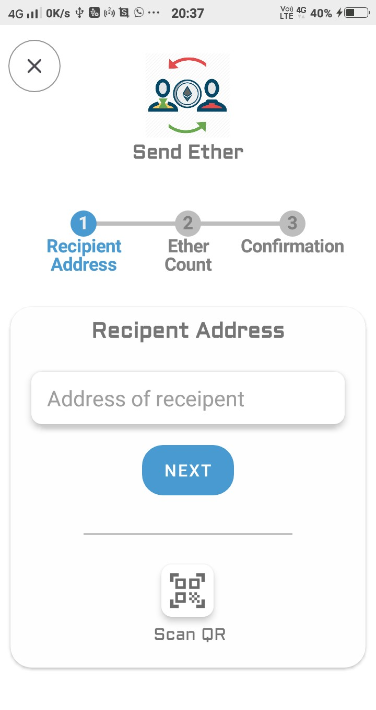</a>
#<a href="url">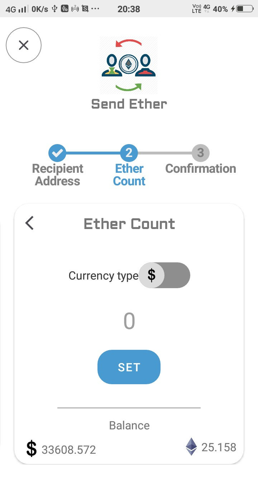</a>
#<a href="url">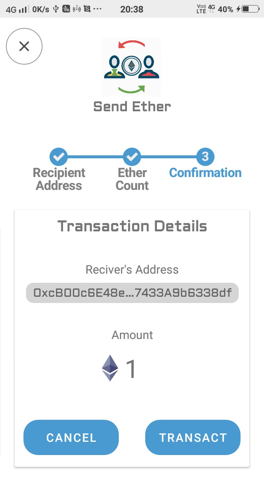</a>

- Get Some latest Transaction and a all transaction List

#<a href="url">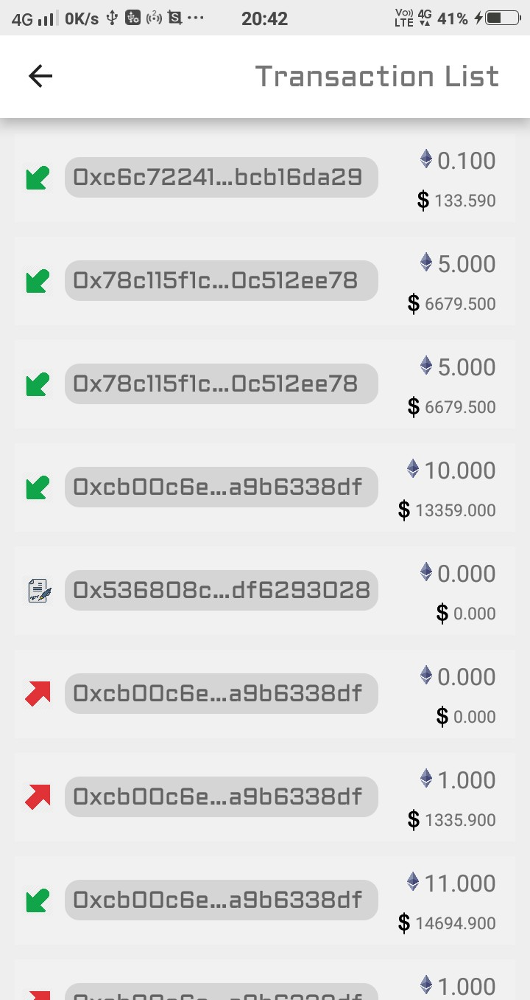</a>
#<a href="url">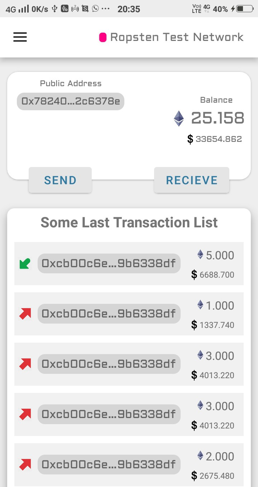</a>

- Get the Public key of others by Scanning Qr Code

#<a href="url">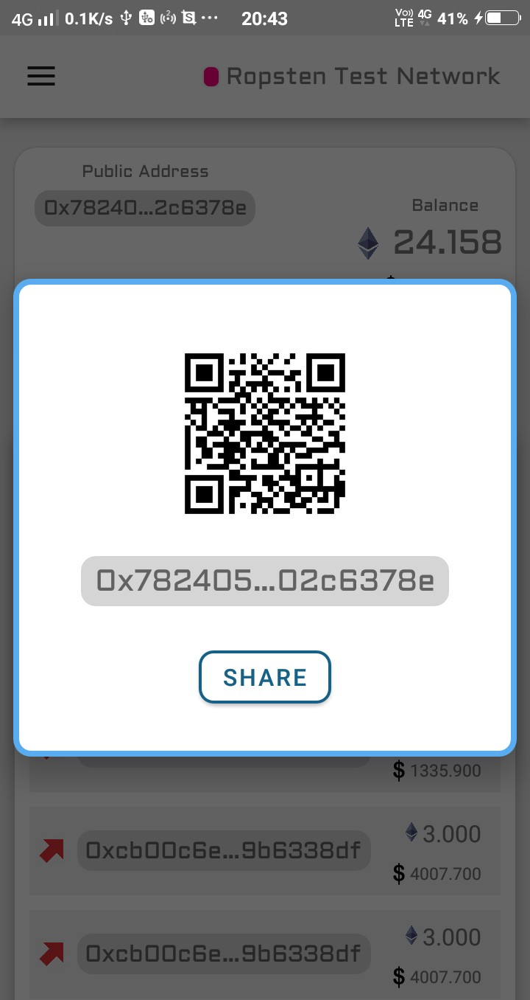</a>

- Get the Detail of balance in Ethers as well as in other currencies also

#<a href="url">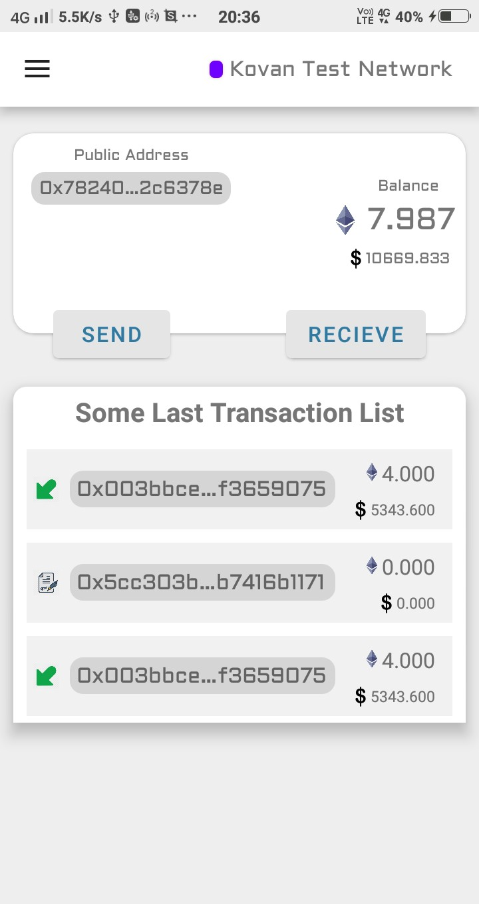</a>

- Share your public Address with other

#<a href="url">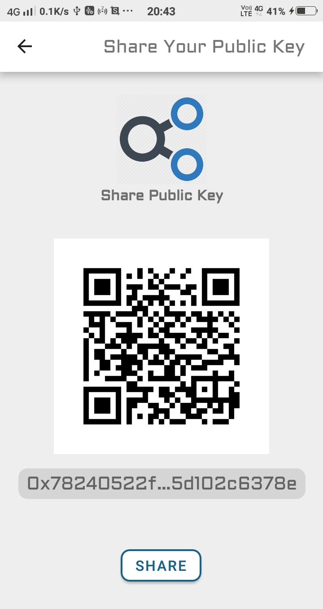</a>

- To secure the wallet from other,You Should Set a four digit PIN, Which is must condition to Open it

#<a href="url">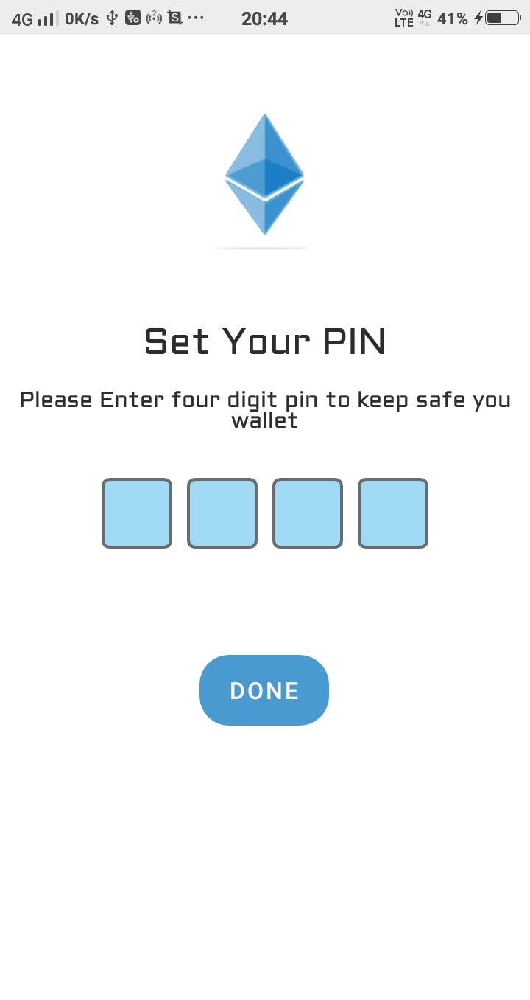</a>

- You can also change this PIN inside the App

#<a href="url">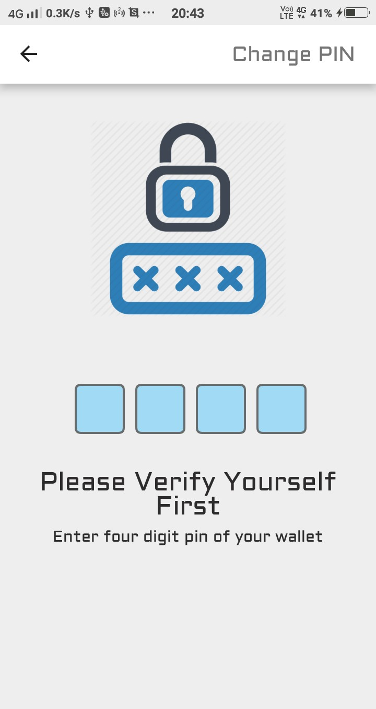</a>
#<a href="url">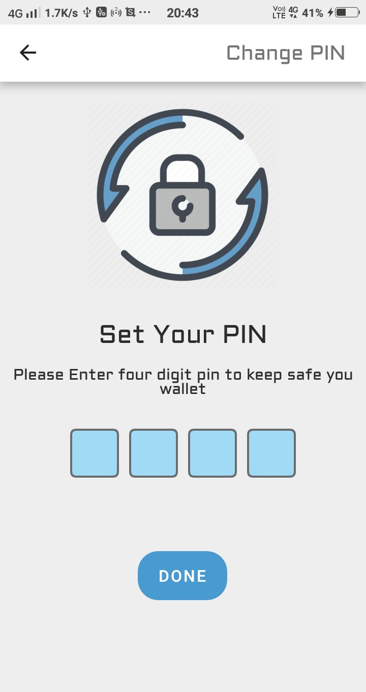</a>

- You can easily switch between different networks

#<a href="url">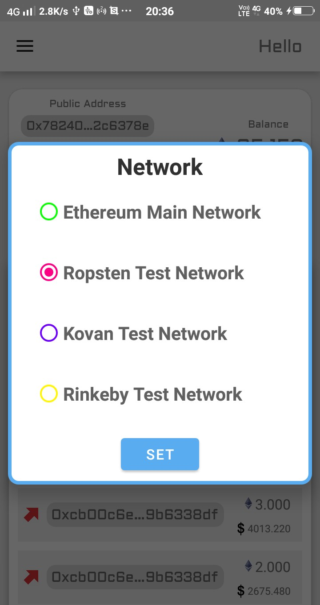</a>

- There is also an option to send funds in different currencies

#<a href="url">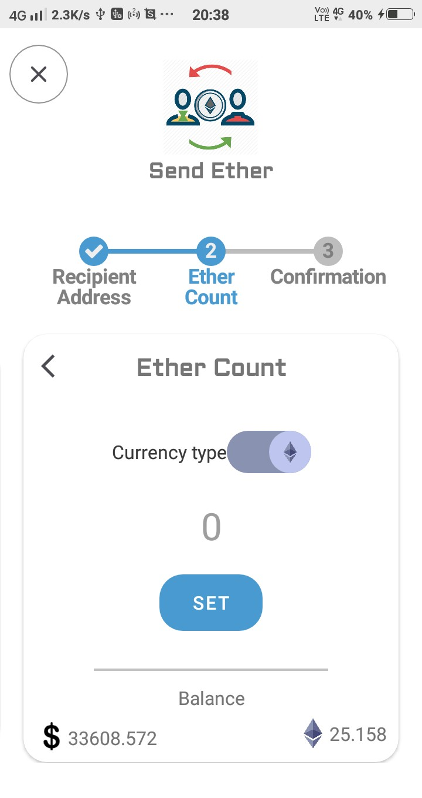</a>

- In this app it is especially take care that user does not have to fill the other important field to make a transaction (like gasLimit and gasRate field)
- Logout, this will erase your all records from the app, Similar to a reset option

#<a href="url">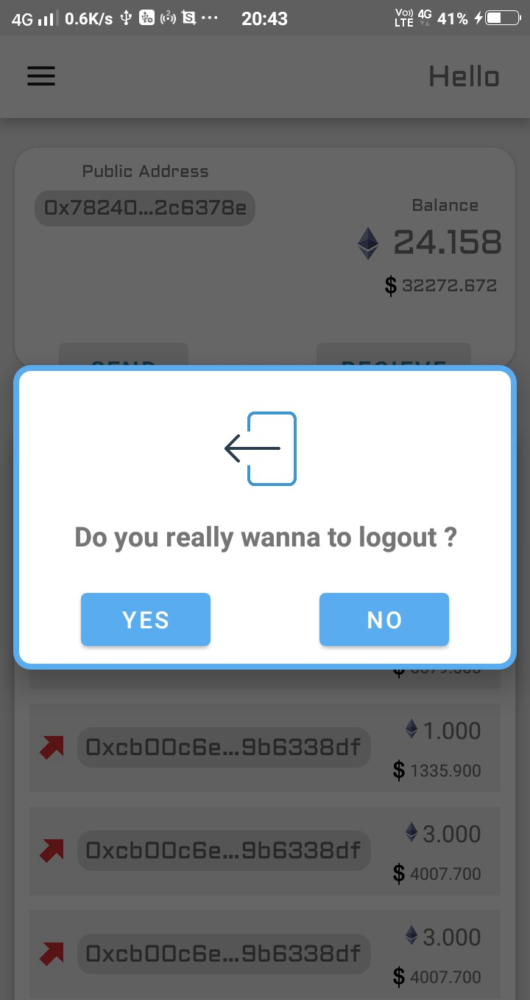</a>

- Easily copy your public address to clip board

### Tech Stack
- Programming Languages
  - JAVA
  - Solidity
  - XML
- Some Important FrameWork and API's
  - Ethereum Blockchain
  - Web3j
  - Infura
  - EtherScan
  - CoinBase
- UI
  - Material Design
  - Android Basic UI
  - Google Standard Designs

### Working
This application works on Ethereum Blockchain.

To interact with Blockchin, it uses [Infura](https://infura.io/) blockchin full node
to communicate with [Infura](https://infura.io/), it uses [Web3j](http://web3j.io/) framework.

It Supports Many Different Networks:
- Ethereum Main
- Ropsten
- Kovan
- Rinkeby

To get the List of Transactions of an Account through Public Key it uses [EtherScan](https://etherscan.io/) Api

To get the Exchange Rates of Ether with other Currencies it uses [Coinbase](https://www.coinbase.com/) Api

### Setup Steps
**This App require minimum SDK level 21**

If You use this App through Github repo then you need two Keys
- [EtherScan](https://etherscan.io/)
- [Infura](https://infura.io/)

And paste those key in Build.gradle of module

<a href="url">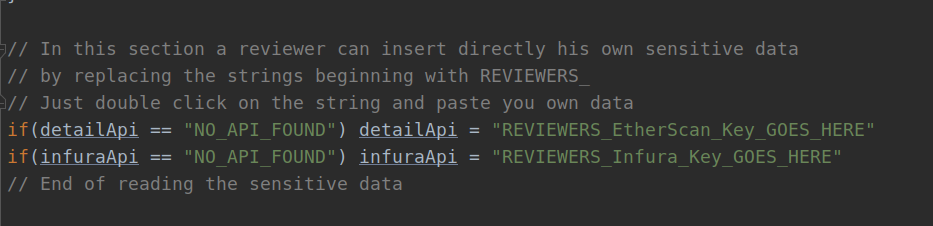</a>

After adding this Just Build it and Now you can use it.

> I hope You like it